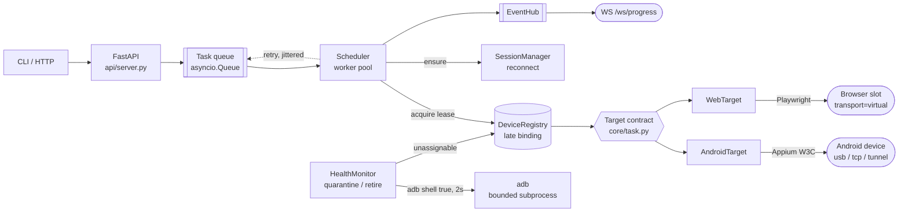

# device-orchestrator

An asyncio orchestrator that runs the same automation task against an Android
device or a browser, keeps a fleet of devices working unattended, and reports
progress over WebSocket.

```bash
pip install -r requirements.txt
python cli.py demo                    # full run, no adb / Appium / browser needed
python -m unittest discover -s tests  # 16 tests, ~3s
python cli.py serve --fake            # HTTP + WebSocket on :8080
```

`demo` scripts a three-phone fleet in which one phone goes dark two seconds in.
It is the fastest way to see what this project is actually about, which is not
"drive a phone" — it is what happens to the queue when a phone stops answering.

This document is about why the code is shaped this way. What each module does is
in the module docstrings.



Everything left of `Target contract` is `core/`, and it imports neither Appium,
Playwright nor HTTP. A browser slot is registered as a device with
`transport="virtual"`, so leases, selectors and concurrency limits work on
browsers with no special case anywhere in `core/`.

---

## Why the modules are split where they are

The split follows one rule: **each module owns one decision, and no decision is
made in two places.**

| Module | The one decision it owns |
|---|---|
| `core/task.py` | What "a unit of work" and "a way to fail" mean |
| `core/device.py` | What devices exist, and who is allowed to touch one right now |
| `core/session.py` | When a remote session is stale and how hard to try reopening it |
| `core/health.py` | When a device is sick, how to fix it, and when to stop trying |
| `core/scheduler.py` | Which work runs next, on what, and whether to retry |
| `targets/*.py` | How to turn steps into commands for one backend |
| `api/*.py` | How the outside world submits work and watches it |
| `obs/log.py` | What a log line looks like |

Three of those boundaries were the ones worth arguing about.

### The Task contract is the seam, and it is narrow on purpose

`Target.execute(spec, lease, ctx)` returns a dict, or raises `RetryableError` or
`FatalError`. That is the entire interface between the scheduler and every
automation backend.

The scheduler never imports `targets/`. It holds a `dict[str, Target]` handed to
it at construction. `AndroidTarget` and `WebTarget` are peers — there is no
`if kind == "android"` anywhere in `core/`, and adding an iOS or desktop target
requires no change to the scheduler at all.

The narrowness is the point. A wider contract — letting targets report their own
retry counts, request specific devices mid-run, or reach into the registry —
would put retry policy in six places at once, which is how retry policy
silently stops being a policy.

Two consequences fall out of the same choice:

- **A browser slot is registered as a `Device`** with `transport="virtual"`.
  Browser concurrency is then the same mechanism as phone concurrency: the same
  leases, the same selectors, the same queue. The alternative — a second,
  parallel "browser pool" concept — means every feature gets built twice.
- **Errors carry blame.** `RetryableError(blames_device=True)` is the difference
  between "the app showed an unexpected screen" and "the phone stopped
  answering". Only the second one counts towards quarantining hardware, so a
  buggy script cannot take a healthy device out of the fleet. This distinction
  took one line in the type and removed an entire class of failure.

### Device assignment happens as late as possible

There is one shared queue, not a queue per device. A task learns which device it
runs on at the moment a worker leases one, not at submit time.

Committing a task to a device at submit time is simpler and is the wrong trade:
if that device dies, everything queued behind it dies with it, and the retry
lands on the same broken hardware. With late binding, a retry naturally goes
somewhere else — which is the single most valuable property in the whole system,
and it is a consequence of queue shape rather than of any recovery code.

### The deadline is enforced from outside the target

`asyncio.wait_for` cancels the target coroutine. The target does not time itself
out.

A target that has wedged is, by definition, not in a position to notice that it
has wedged. Self-imposed timeouts only work for code that is still running, and
the failures that matter here are precisely the ones where it is not. Everything
under `Adb.run` is bounded the same way and kills the process group on timeout,
because a phone that has stopped answering makes `adb` hang forever rather than
return an error.

---

## What happens when a device wedges

This is the question the design exists to answer, so here it is end to end.

```
task running on phone-3
   │
   ├── the phone stops answering
   │
   ├── the step raises SessionGone -> RetryableError(blames_device=True)
   │
   ├── scheduler: await health.quarantine(phone-3)      <- awaited, before release
   │      ├── device state -> QUARANTINED  (now unassignable)
   │      ├── cached session invalidated
   │      └── recovery spawned in the background
   │
   ├── scheduler releases the lease   (phone-3 is already out of the pool)
   │
   ├── task requeued with jittered exponential backoff, attempt 2 of 3
   │      └── it is counted as a pending retry, so drain() knows it is not done
   │
   ├── a worker picks it up, leases phone-1, runs it, succeeds
   │
   └── meanwhile, in the background:
          adb reconnect -> probe
             ├── answers   -> back to ONLINE
             └── still dark -> stays QUARANTINED, health keeps probing
                               and after N recoveries in a window -> RETIRED
```

Three details in there are load-bearing, and all three came out of running it.

**Quarantine is awaited before the lease is released.** The first version fired
it off with `create_task`. The demo trace showed the next task in the queue
leasing the phone that had just failed, in the window before the state change
landed. Marking a device unassignable is cheap and is now awaited; the recovery
behind it — which can take tens of seconds — is what runs in the background.

**Retries in backoff are counted.** The first version let `drain()` report the
fleet idle while a task was still sleeping out its backoff, so a caller could
walk away from unfinished work. A task is now visible to `drain()` from the
moment it is scheduled for retry, not from the moment it re-enters the queue.

**Virtual slots are not adb-probed.** The first served run quarantined every
browser slot inside thirty seconds: the health monitor ran `adb shell true`
against `browser-1`, which obviously failed, twice, and pulled it from the pool.
The health monitor now probes only transports adb can reach. A browser slot
proves itself when a session opens on it, and that failure path already exists.

### Retirement

A device that needs recovering every few minutes is not recovering; it is
oscillating. An orchestrator that keeps handing it work is choosing to fail
every task that lands on it. After N recoveries inside a rolling window the
device goes to `RETIRED` and stays there until a human intervenes.

Retirement costs one device and protects the queue. It is also the only state
that should page someone — everything else is the system absorbing a fault,
which is what it is for.

---

## Logging

Every line is one JSON object. There is no human-readable mode.

A correlation id is minted per task and stored in a `contextvars.ContextVar`, so
asyncio tasks inherit it automatically across every `await`. The practical test:

```bash
grep cid-87d59c0d3b89 orchestrator.log
```

```
task.submitted    dev=-
device.leased     dev=browser-1
task.started      dev=browser-1
task.progress     dev=browser-1  session
session.opened    dev=browser-1
task.progress     dev=browser-1  step
task.succeeded    dev=browser-1
device.released   dev=browser-1
```

One grep, the whole life of one task, including the parts that ran in other
coroutines. Event names (`task.requeued`, `device.quarantined`) are stable
identifiers you can alert on, not sentences — a log you cannot aggregate is a
log you only read after the incident.

---

## What I deliberately did not build

Most of this section is more interesting than the feature list, because in an
unattended system the things you leave out are what you have decided to be
honest about.

**No persistence.** Task state is in memory. Restart the process and the queue
is gone. Durable state is a real requirement for a real deployment, and it is
also the single biggest source of accidental complexity — once a queue is
durable you owe it migrations, compaction, idempotency on replay and a story for
partially-applied side effects. That is a deliberate second version, informed by
what the workload actually turns out to be, not a guess made on day one. The
seam is ready: `Scheduler._records` is the only state that would need a backing
store.

**No distributed scheduling.** One process owns one fleet. Multiple hosts would
need distributed leases, and a lease that can be lost without the holder
noticing is a much harder problem than the one this solves. The honest scaling
story here is one orchestrator per bench with a router in front, not consensus.

**No retry inside a step.** Steps fail the whole attempt. Per-step retry looks
cheap and interacts badly with everything around it: a step that retries five
times inside a task with a 120s deadline has silently spent the task's entire
budget without telling the scheduler. One budget, enforced in one place.

**No exactly-once semantics — retries are at-least-once, and that is a real
limitation.** When a task times out, the scheduler cannot tell whether the
target got far enough to cause a side effect on the device before it was
cancelled. It retries anyway. For idempotent work that is correct; for work with
external side effects it is not, and no amount of retry tuning fixes it.

The honest fix is not more retries, it is a state distinction: an interrupted
unit of work that never started and one that was already running deserve
*opposite* treatment, and only the second one carries evidence that something
happened. The error taxonomy in `core/task.py` is where that distinction would
live — `RetryableError` already separates "the app misbehaved" from "the device
died", and a third case ("it may have taken effect") is the missing one. It is
missing because getting it right needs a claim/settle handshake with the target,
and inventing that protocol against a fake driver would be designing for a
workload I have not measured.

**No screenshot/artifact pipeline.** It is the obvious next thing and it is
mostly plumbing — upload, retention, a URL in the result dict. It would have
added the most lines and demonstrated the least about orchestration.

**No auth on the API.** It binds to `127.0.0.1` by default and is meant to sit
behind something that does authentication properly. A hand-rolled token check
here would be worse than none, because it would look like security.

**Playwright is optional.** Without it, `targets/web.py` falls back to an
in-process fake driver and the orchestration still runs end to end. A project
that can only be evaluated after a 400MB browser download is a project that does
not get evaluated.

**The fakes are not a test-only path.** `FakeAndroidDriver` implements the same
surface as `AppiumDriver`, and the scheduler, session manager and target cannot
tell them apart. The thing under test is the orchestration, and orchestration
bugs are exactly the ones you cannot reproduce on demand with real hardware. All
three bugs described above were found by running `demo` and `serve`, not by
reading the code.

---

## Layout

```
cli.py                  devices / run / serve / demo
core/task.py            TaskSpec, Target, the error taxonomy, TaskContext
core/device.py          Adb subprocess wrapper, Device, DeviceRegistry, Lease
core/session.py         SessionManager: reconnect, backoff, generations
core/health.py          probe -> quarantine -> recover -> retire
core/scheduler.py       asyncio worker pool, leases, deadlines, retry
targets/android.py      Appium W3C client + AndroidTarget + fakes
targets/web.py          Playwright + WebTarget + fakes + browser slots
api/server.py           FastAPI routes, Orchestrator wiring
api/ws.py               EventHub, bounded fan-out, heartbeats
obs/log.py              JSON formatter, correlation-id context
tests/                  16 tests, mostly failure paths
```

## API

| Route | Purpose |
|---|---|
| `GET /healthz` | liveness, plus `ready` = at least one assignable device |
| `GET /devices` | inventory, health counters, open sessions |
| `POST /tasks` | submit a `TaskSpec`; `202` with the record, `422` if malformed |
| `GET /tasks/{id}` | one task, with every attempt and which device it used |
| `WS /ws/progress` | live `task.state` / `task.progress` / `device.*` events |

`/healthz` separates liveness from readiness on purpose: the process can be
perfectly healthy with nothing to run work on, and a deploy pipeline that
conflates the two restart-loops an orchestrator whose bench is simply empty.

The WebSocket fan-out is bounded per subscriber and drops oldest-first on
overflow. A stalled browser tab must never be able to stall the fleet, and for a
progress feed recent state is worth more than complete history — the complete
history is in the JSON log.
