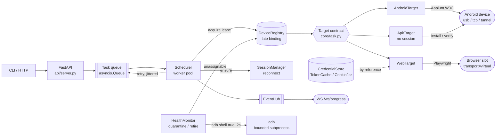

# device-orchestrator

[](https://github.com/WanChoon/device-orchestrator/actions/workflows/ci.yml)

An asyncio orchestrator that runs the same automation task against an Android
device or a browser, deploys builds across a phone fleet, keeps that fleet
working unattended, and reports progress over WebSocket.

```bash
python cli.py demo                    # full run: no install, no adb, no Appium, no browser
python cli.py deploy --fake           # APK rollout across a fleet, no phone needed
python -m unittest discover -s tests  # 70 tests, ~5s

pip install -r requirements.txt       # only `serve` needs anything
python cli.py serve --fake            # live console on http://127.0.0.1:8080/
```

`serve --fake` brings up a three-phone fleet and a console you can watch: click
**stop answering** on a phone and the queue re-routes in front of you. That is
the same run as `demo`, with the trace on screen instead of in the terminal.

Everything except `serve` runs on a bare standard-library install — no FastAPI,
no Playwright, no Appium, nothing to download. That is enforced by a CI job
rather than asserted here, because it stopped being true within a day of the
workflow being added.

`demo` scripts a three-phone fleet in which one phone goes dark two seconds in.
It is the fastest way to see what this project is actually about, which is not
"drive a phone" — it is what happens to the queue when a phone stops answering.

This document is about why the code is shaped this way. What each module does is
in the module docstrings.



Everything left of `Target contract` is `core/`, and it imports neither Appium,
Playwright nor HTTP. A browser slot is registered as a device with
`transport="virtual"`, so leases, selectors and concurrency limits work on
browsers with no special case anywhere in `core/`.

---

## Why the modules are split where they are

The split follows one rule: **each module owns one decision, and no decision is
made in two places.**

| Module | The one decision it owns |
|---|---|
| `core/task.py` | What "a unit of work" and "a way to fail" mean |
| `core/device.py` | What devices exist, and who is allowed to touch one right now |
| `core/session.py` | When a remote session is stale and how hard to try reopening it |
| `core/health.py` | When a device is sick, how to fix it, and when to stop trying |
| `core/scheduler.py` | Which work runs next, on what, and whether to retry |
| `core/auth.py` | Where secrets live, when a token is stale, who may log in |
| `core/orchestrator.py` | How the parts are wired together and started |
| `targets/*.py` | How to turn steps into commands for one backend |
| `api/*.py` | How the outside world submits work and watches it |
| `obs/log.py` | What a log line looks like |

Three of those boundaries were the ones worth arguing about.

### The Task contract is the seam, and it is narrow on purpose

`Target.execute(spec, lease, ctx)` returns a dict, or raises `RetryableError` or
`FatalError`. That is the entire interface between the scheduler and every
automation backend.

The scheduler never imports `targets/`. It holds a `dict[str, Target]` handed to
it at construction. `AndroidTarget`, `WebTarget` and `ApkTarget` are peers —
there is no `if kind == "android"` anywhere in `core/`, and adding an iOS or
desktop target requires no change to the scheduler at all. `ApkTarget` arrived
after the other two and needed no change to `core/`, which is the only evidence
for that claim worth anything.

The narrowness is the point. A wider contract — letting targets report their own
retry counts, request specific devices mid-run, or reach into the registry —
would put retry policy in six places at once, which is how retry policy
silently stops being a policy.

Two consequences fall out of the same choice:

- **A browser slot is registered as a `Device`** with `transport="virtual"`.
  Browser concurrency is then the same mechanism as phone concurrency: the same
  leases, the same selectors, the same queue. The alternative — a second,
  parallel "browser pool" concept — means every feature gets built twice.
- **Errors carry blame.** `RetryableError(blames_device=True)` is the difference
  between "the app showed an unexpected screen" and "the phone stopped
  answering". Only the second one counts towards quarantining hardware, so a
  buggy script cannot take a healthy device out of the fleet. This distinction
  took one line in the type and removed an entire class of failure.

### Device assignment happens as late as possible

There is one shared queue, not a queue per device. A task learns which device it
runs on at the moment a worker leases one, not at submit time.

Committing a task to a device at submit time is simpler and is the wrong trade:
if that device dies, everything queued behind it dies with it, and the retry
lands on the same broken hardware. With late binding, a retry naturally goes
somewhere else — which is the single most valuable property in the whole system,
and it is a consequence of queue shape rather than of any recovery code.

### The deadline is enforced from outside the target

`asyncio.wait_for` cancels the target coroutine. The target does not time itself
out.

A target that has wedged is, by definition, not in a position to notice that it
has wedged. Self-imposed timeouts only work for code that is still running, and
the failures that matter here are precisely the ones where it is not. Everything
under `Adb.run` is bounded the same way and kills the process group on timeout,
because a phone that has stopped answering makes `adb` hang forever rather than
return an error.

---

## What happens when a device wedges

This is the question the design exists to answer, so here it is end to end.

```
task running on phone-3
   │
   ├── the phone stops answering
   │
   ├── the step raises SessionGone -> RetryableError(blames_device=True)
   │
   ├── scheduler: await health.quarantine(phone-3)      <- awaited, before release
   │      ├── device state -> QUARANTINED  (now unassignable)
   │      ├── cached session invalidated
   │      └── recovery spawned in the background
   │
   ├── scheduler releases the lease   (phone-3 is already out of the pool)
   │
   ├── task requeued with jittered exponential backoff, attempt 2 of 3
   │      └── it is counted as a pending retry, so drain() knows it is not done
   │
   ├── a worker picks it up, leases phone-1, runs it, succeeds
   │
   └── meanwhile, in the background:
          adb reconnect -> probe
             ├── answers   -> back to ONLINE
             └── still dark -> stays QUARANTINED, health keeps probing
                               and after N recoveries in a window -> RETIRED
```

Three details in there are load-bearing, and all three came out of running it.

**Quarantine is awaited before the lease is released.** The first version fired
it off with `create_task`. The demo trace showed the next task in the queue
leasing the phone that had just failed, in the window before the state change
landed. Marking a device unassignable is cheap and is now awaited; the recovery
behind it — which can take tens of seconds — is what runs in the background.

**Retries in backoff are counted.** The first version let `drain()` report the
fleet idle while a task was still sleeping out its backoff, so a caller could
walk away from unfinished work. A task is now visible to `drain()` from the
moment it is scheduled for retry, not from the moment it re-enters the queue.

**Virtual slots are not adb-probed.** The first served run quarantined every
browser slot inside thirty seconds: the health monitor ran `adb shell true`
against `browser-1`, which obviously failed, twice, and pulled it from the pool.
The health monitor now probes only transports adb can reach. A browser slot
proves itself when a session opens on it, and that failure path already exists.

### Retirement

A device that needs recovering every few minutes is not recovering; it is
oscillating. An orchestrator that keeps handing it work is choosing to fail
every task that lands on it. After N recoveries inside a rolling window the
device goes to `RETIRED` and stays there until a human intervenes.

Retirement costs one device and protects the queue. It is also the only state
that should page someone — everything else is the system absorbing a fault,
which is what it is for.

---

## Deploying a build to the whole fleet

```bash
python cli.py deploy --apk build/app.apk --package com.example.app \
                     --expect-version 1.4.2 --launch
```

`ApkTarget` is a `Target` like the other two, so a rollout gets leases,
deadlines, retries, blame and the progress feed without the scheduler learning
what a package is. It is also the target that proves the contract was narrow
enough: **it holds no `SessionManager`.** Sessions were an Appium and Playwright
detail, not a contract detail, and a target that needs none is the only way to
find that out.

Three things shape the module, and none of them are about installing.

**A rollout is the one workload where late binding is wrong.** Everywhere else a
task wants *a* device and the queue picks; a rollout wants *every* device. So
`deploy` submits one task per device pinned with `selector.device_id` — the same
selector any task can use. There is no separate rollout mechanism, because a
second one would mean maintaining retry, health and reporting twice. A partial
rollout is then reported as a failure with a list, not a success with a warning:
a fleet running two builds makes every later result depend on which phone the
task happened to land on.

**The exit code is not the verdict.** `adb install`, and `adb shell pm install`
much more so, have across versions printed `Failure [INSTALL_FAILED_…]` on
stdout while exiting `0`. Trusting `returncode` gives you a green deploy of a
build that is not on the phone — worse than a red one, because nobody goes
looking. The output is parsed, and silence is treated as failure rather than
optimistically passed.

**Install failures split three ways, and the middle one is the interesting one.**

| Failure | Classified as | Why |
|---|---|---|
| `UPDATE_INCOMPATIBLE`, `VERSION_DOWNGRADE`, parse failures | `FatalError` | Fails identically on every phone. Retrying burns the bench to reproduce one message N times. |
| `NO_MATCHING_ABIS`, `OLDER_SDK` | `RetryableError(blames_device=False)` | A *healthy* phone that is the wrong phone. Send the task elsewhere; hold nothing against it. The real fix is a selector — retry is the fallback for when bench tags have drifted. |
| `INSUFFICIENT_STORAGE`, `MEDIA_UNAVAILABLE`, offline, timeout | `RetryableError(blames_device=True)` | It will still be out of space for the next task. Quarantine it. |

That middle row is why the error taxonomy carries blame instead of a boolean.
Without it, an ABI mismatch on a mixed-architecture bench quarantines every
phone it touches, and the fleet retires itself over a build that was never
meant for those devices.

Finally, `verify` is a separate step, because *installed* and *having installed*
are different claims. A `Success` means the package manager committed a session;
it does not mean the version you wanted is what a user would launch — not when a
deploy races an OEM updater or a work profile. `verify` reads `versionName` back
out of `dumpsys`, and an install that reported success against a package
`dumpsys` has never heard of blames the device, because no other phone will
reproduce it. Each install also records the SHA-256 of the bytes that shipped: a
deploy log naming a path records an intention, one naming a digest records an
event, and paths get overwritten by the next CI run.

---

## Credentials, tokens and sessions

Auth arrives in an orchestrator as three unrelated problems, and conflating them
is how automation gets locked out of the system it is automating.

**A TaskSpec is not a place to put a password.** Specs are serialised to JSON,
accepted over HTTP, echoed back from `/tasks/{id}` and written to the log on
every state change. A password in `spec.params` is therefore a password in the
log, and scrubbing downstream does not fix it — the fix is that it was never
there. Specs carry a reference (`{"op": "auth", "credential": "demo-bank"}`) and
`CredentialStore` resolves it inside the target at the moment of use. Secrets are
wrapped in a `Secret` that refuses to print itself, so a leak has to be an
explicit `.reveal()` that shows up in review rather than an f-string in a stack
trace.

**A token's expiry is knowable, so waiting for a 401 is a choice.** A JWT carries
`exp` in cleartext. Refreshing at `exp - skew` costs one request; discovering
expiry by failing a task costs the task, its retry, and a device-blaming signal
that was never the device's fault. `core/auth.py` reads the claim and does *not*
verify the signature — the client is not the verifier, and checking a signature
against a key we also hold would be theatre. The unverified claim is used as a
scheduling hint, never as an authorisation decision.

**Re-authenticating is the expensive operation.** Twenty workers whose token
expired in the same second will, without coordination, fire twenty logins at
once — which is indistinguishable from credential stuffing and is how a fleet
gets rate-limited or an account gets locked. `TokenCache` refresh is
single-flight per realm, and `CookieJar` keeps a logged-in session that later
tasks reuse, so N tasks do not mean N logins. The jar also reports a session of
entirely expired cookies as *not live*, because a dead jar is worse than an
empty one: the next task looks logged in until its first protected request, and
the failure surfaces somewhere unrelated to its cause.

Because bad credentials fail identically everywhere, an auth failure is
`FatalError`, not a retry. Retrying a wrong password across a fleet is just a
faster way to get the account locked.

Encryption at rest uses AES-GCM when `cryptography` is installed. It is not a
required dependency, so there is a stdlib fallback — scrypt for derivation, an
HMAC-SHA256 counter-mode keystream, encrypt-then-MAC, constant-time tag
comparison, a fresh random nonce per seal. That construction is sound and it is
still hand-rolled, which is a thing to do deliberately, once, and say out loud:
it exists so this repo can be evaluated without installing anything. The honest
production answer is AES-GCM via `cryptography`, or better, never holding the
key and asking a KMS. `SecretBox` is the single seam either answer plugs into.

---

## The console

`serve` publishes a single-file page at `/` that renders the fleet live. Three
decisions in it are worth stating, and the first one is the one I got wrong.

**"Stopped answering" and "diagnosed as unwell" are two different facts.** The
first version of the console showed only device health, so clicking *stop
answering* appeared to do nothing — the phone stayed `online` until the health
monitor caught up, which on the default policy is up to thirty seconds. The
button looked broken. It was not: the gap it exposed *is the subject of this
project*, and collapsing the two facts into one row hid exactly the thing worth
watching.

So the console now shows both. A silenced phone is marked immediately and stays
`online` — still assignable, because it genuinely still is — with a counter
reading *silent for 2.4s, the system has not noticed yet*. When the system does
react, the counter freezes at how long it took. There are two ways it finds out,
and the difference is visible:

| | how it is discovered | typical |
|---|---|---|
| a phone with work on it | the task fails and blames the device | ~0.4s |
| an idle phone | the health probe misses twice | ~4s |

**Operator actions share the timeline with the system's reactions.** Darkening a
device publishes a `demo.darkened` event — not as a state change, but so the
feed can answer "did I cause that, or did it just happen?", which is the first
question anyone watching a fleet asks:

```
demo.darkened         demo-phone-2 — operator: driver told to stop answering
device.quarantined    demo-phone-2 — probe failed
device.recovery_failed demo-phone-2
```

**The socket is a change log; REST is the truth.** `EventHub` bounds every
subscriber's queue and drops oldest-first under pressure — deliberately, so a
stalled browser tab can never stall the fleet. A page that derived its state
purely from that stream would drift, silently, in precisely the busy moments
when someone is watching. So the console listens for immediacy and polls
`/devices` and `/tasks` for correctness; when they disagree, the poll wins. The
heartbeat carries that subscriber's server-side drop count and the page says so
out loud, because a feed that silently skips events looks identical to one that
has not missed any.

The controls are passed into the `Orchestrator` as an object, not enabled by a
config flag. Against a real fleet nothing is handed in, so the routes return 404
— not 403, which would imply a deployment where a button that kills a phone
might legitimately exist. Darkening marks nothing unwell and tears down no
session; the driver simply stops answering, and everything after that is the
system working it out on its own.

The page loads nothing from the network — no CDN, no fonts, no framework —
because a console is most needed on the bench with no route to the internet. A
test asserts it.

---

## Logging

Every line is one JSON object. There is no human-readable mode.

A correlation id is minted per task and stored in a `contextvars.ContextVar`, so
asyncio tasks inherit it automatically across every `await`. The practical test:

```bash
grep cid-87d59c0d3b89 orchestrator.log
```

```
task.submitted    dev=-
device.leased     dev=browser-1
task.started      dev=browser-1
task.progress     dev=browser-1  session
session.opened    dev=browser-1
task.progress     dev=browser-1  step
task.succeeded    dev=browser-1
device.released   dev=browser-1
```

One grep, the whole life of one task, including the parts that ran in other
coroutines. Event names (`task.requeued`, `device.quarantined`) are stable
identifiers you can alert on, not sentences — a log you cannot aggregate is a
log you only read after the incident.

---

## What I deliberately did not build

Most of this section is more interesting than the feature list, because in an
unattended system the things you leave out are what you have decided to be
honest about.

**No persistence.** Task state is in memory. Restart the process and the queue
is gone. Durable state is a real requirement for a real deployment, and it is
also the single biggest source of accidental complexity — once a queue is
durable you owe it migrations, compaction, idempotency on replay and a story for
partially-applied side effects. That is a deliberate second version, informed by
what the workload actually turns out to be, not a guess made on day one. The
seam is ready: `Scheduler._records` is the only state that would need a backing
store.

**No distributed scheduling.** One process owns one fleet. Multiple hosts would
need distributed leases, and a lease that can be lost without the holder
noticing is a much harder problem than the one this solves. The honest scaling
story here is one orchestrator per bench with a router in front, not consensus.

**No retry inside a step.** Steps fail the whole attempt. Per-step retry looks
cheap and interacts badly with everything around it: a step that retries five
times inside a task with a 120s deadline has silently spent the task's entire
budget without telling the scheduler. One budget, enforced in one place.

**No exactly-once semantics — retries are at-least-once, and that is a real
limitation.** When a task times out, the scheduler cannot tell whether the
target got far enough to cause a side effect on the device before it was
cancelled. It retries anyway. For idempotent work that is correct; for work with
external side effects it is not, and no amount of retry tuning fixes it.

The honest fix is not more retries, it is a state distinction: an interrupted
unit of work that never started and one that was already running deserve
*opposite* treatment, and only the second one carries evidence that something
happened. The error taxonomy in `core/task.py` is where that distinction would
live — `RetryableError` already separates "the app misbehaved" from "the device
died", and a third case ("it may have taken effect") is the missing one. It is
missing because getting it right needs a claim/settle handshake with the target,
and inventing that protocol against a fake driver would be designing for a
workload I have not measured.

**No screenshot/artifact pipeline.** It is the obvious next thing and it is
mostly plumbing — upload, retention, a URL in the result dict. It would have
added the most lines and demonstrated the least about orchestration.

**No auth on the orchestrator's own API** — which is a different question from
the credential handling above, and worth separating because the two get
confused. `core/auth.py` is about proving *the fleet's* identity to the systems
it automates. The `/tasks` API has no authentication of its own: it binds to
`127.0.0.1` and is meant to sit behind something that does it properly. A
hand-rolled token check on the ingress would be worse than none, because it
would look like security.

**No custom ROM work, and no flashing.** The JD-adjacent version of this project
would image devices as well as deploy to them, and it does not: `fastboot`,
unlock state, A/B slots and recovery are a different discipline from
orchestration, and a bench that can brick itself deserves more care than a
portfolio repo can honestly show. Deployment here stops at `pm install`.

**Playwright is optional.** Without it, `targets/web.py` falls back to an
in-process fake driver and the orchestration still runs end to end. A project
that can only be evaluated after a 400MB browser download is a project that does
not get evaluated.

**The fakes are not a test-only path.** `FakeAndroidDriver` implements the same
surface as `AppiumDriver`, and the scheduler, session manager and target cannot
tell them apart. The thing under test is the orchestration, and orchestration
bugs are exactly the ones you cannot reproduce on demand with real hardware. All
three bugs described above were found by running `demo` and `serve`, not by
reading the code.

---

## Layout

```
cli.py                  devices / run / deploy / serve / demo
core/task.py            TaskSpec, Target, the error taxonomy, TaskContext
core/device.py          Adb subprocess wrapper, Device, DeviceRegistry, Lease
core/session.py         SessionManager: reconnect, backoff, generations
core/health.py          probe -> quarantine -> recover -> retire
core/scheduler.py       asyncio worker pool, leases, deadlines, retry
core/auth.py            Secret, SecretBox, JWT expiry, TokenCache, CookieJar
core/orchestrator.py    assembly and lifecycle; the only place that knows the wiring
targets/android.py      Appium W3C client + AndroidTarget + fakes
targets/web.py          Playwright + WebTarget + auth ops + fakes + slots
targets/apk.py          install / verify / launch, the blame taxonomy, FakeAdb
api/server.py           FastAPI routes -- the only module that imports FastAPI
api/dashboard.html      the live console: one file, no build step, no CDN
api/ws.py               EventHub, bounded fan-out, heartbeats
obs/log.py              JSON formatter, correlation-id context
tests/                  70 tests, mostly failure paths and layering rules
.github/workflows/      tests + demo + rollout + booted API on 3.11-3.13, and a
                        job that installs nothing at all
```

## API

| Route | Purpose |
|---|---|
| `GET /healthz` | liveness, plus `ready` = at least one assignable device |
| `GET /devices` | inventory, health counters, open sessions |
| `POST /tasks` | submit a `TaskSpec`; `202` with the record, `422` if malformed |
| `GET /tasks/{id}` | one task, with every attempt and which device it used |
| `WS /ws/progress` | live `task.state` / `task.progress` / `device.*` events |
| `GET /` | the console |
| `POST /demo/*` | scripted run and device kill switch; 404 without a fake fleet |

`/healthz` separates liveness from readiness on purpose: the process can be
perfectly healthy with nothing to run work on, and a deploy pipeline that
conflates the two restart-loops an orchestrator whose bench is simply empty.

The WebSocket fan-out is bounded per subscriber and drops oldest-first on
overflow. A stalled browser tab must never be able to stall the fleet, and for a
progress feed recent state is worth more than complete history — the complete
history is in the JSON log.
